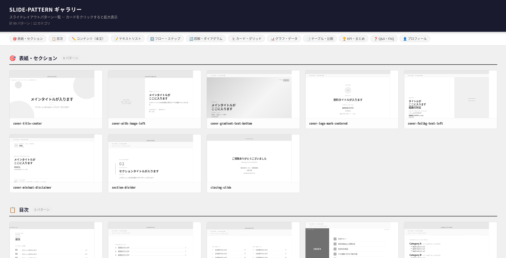

# slide-md

**AIとスライドを作るための、Claude Codeスキルパッケージ。**

スライドのデザインシステム・レイアウトパターン・スライド設計書をAIと一緒に生成するための3つのスキルをまとめたリポジトリです。[Google DESIGN.md](https://stitch.withgoogle.com/docs/design-md/overview) のコンセプトに着想を得た、スライドに特化した設計書フォーマット「SLIDE.md」を中心に構成されています。

## できること

1. **既存のスライド・Webサイトのデザインを解析**して、AIが読めるデザイン定義ファイル（SLIDE.md）を自動生成
2. **スライドのレイアウト構造を抽出**して、再利用可能なパターン定義ファイル（SLIDE-PATTERN-\*.md）を生成
3. **プレゼン内容を入力**すると、デザイン＋パターン＋スライド構成をまとめた設計書（SLIDE-DECK.md）を自動生成

SLIDE-DECK.mdをClaude DesignなどのAIツールに渡すだけで、デザインの一貫したスライドが生成できます。

## スキル一覧

| スキル | できること | 出力ファイル |
|--------|-----------|------------|
| `slide-md-creator` | スライド・画像・Webサイトからデザインシステムを生成 | `SLIDE-md-{name}/SLIDE.md` + `sample.html` |
| `slide-pattern-creator` | スライドのレイアウト構造を解析してパターンを定義 | `SLIDE-PATTERN-{name}/SLIDE-PATTERN-{name}.md` + `.html` |
| `slide-deck-builder` | プレゼン内容をもとにスライド設計書を生成 | `SLIDE-DECK-{name}/SLIDE-DECK-{name}.md` |

## 使い方

### 1. スキルをインストールする

`skills/` フォルダ内の各スキルフォルダを、Claude Codeのスキルディレクトリ（`~/.claude/skills/`）にコピーします。

```bash
cp -r skills/slide-md-creator ~/.claude/skills/
cp -r skills/slide-pattern-creator ~/.claude/skills/
cp -r skills/slide-deck-builder ~/.claude/skills/
```

### 2. デザインシステムを作る（初回のみ）

Claude Codeで作業したいプロジェクトフォルダを開き、以下のように話しかけます。

> 「このスライドのデザインシステムを作って」（画像・Webサイト・PowerPointを添付）

`SLIDE-md-{name}/SLIDE.md` と確認用の `sample.html` が生成されます。

### 3. スライドパターンを追加する（必要なぶんだけ）

> 「スライドパターンを抽出して」（スライドの画像を添付）

`SLIDE-PATTERN-{name}/SLIDE-PATTERN-{name}.md` とスケルトンHTML（グレースケール）が生成されます。

### 4. プレゼンの設計書を作る

> 「プレゼンの設計書を作って」

ブリーフ（タイトル・対象者・目的・枚数）をヒアリングした後、プレゼン内容を受け取り、SLIDE-DECK.md を生成します。このファイル1枚をAIツールに渡すだけでスライドが生成できます。

## ワークフロー

```
Step 1: slide-md-creator  → SLIDE.md（ブランドのデザインを一度定義）
Step 2: slide-pattern-creator → SLIDE-PATTERN-*.md（使いたいレイアウトを随時追加）
Step 3: slide-deck-builder → SLIDE-DECK.md（プレゼンごとに設計書を生成）
Step 4: SLIDE-DECK.md をAIツールへ → スライド完成
```

## パターンギャラリー

99種類のレイアウトパターンをブラウザで一覧確認できます。

**→ https://sho-ai-magic.github.io/slide-md/**



## サンプルファイル

- `examples/design-systems/SLIDE-md-anthropic/` — Anthropicのブランドカラーを参考に生成したデザインシステムの例
- `examples/output/SLIDE.md スキル紹介.pdf` — このスキルパッケージを紹介するスライドの生成例
- `docs/patterns/` — 99種類のレイアウトパターンのHTMLファイル（ギャラリーから参照）

## 設計思想

### デザインと構造の分離

| ファイル | 定義する内容 |
|---------|------------|
| SLIDE.md | 色・フォント・余白・タイトルエリア・ページ番号・装飾（全ページ共通の「枠」） |
| SLIDE-PATTERN-\*.md | コンテンツエリア（タイトル行より下）の構造のみ |

この分離により、同じレイアウトパターンを異なるデザインシステムに使い回せます。

### 1ファイルで完結するSLIDE-DECK.md

SLIDE-DECK.mdにはSLIDE.mdとSLIDE-PATTERN-\*.mdの内容がすべて埋め込まれます。AIツールに渡すファイルは1枚だけで済みます。

## ライセンス

MIT
