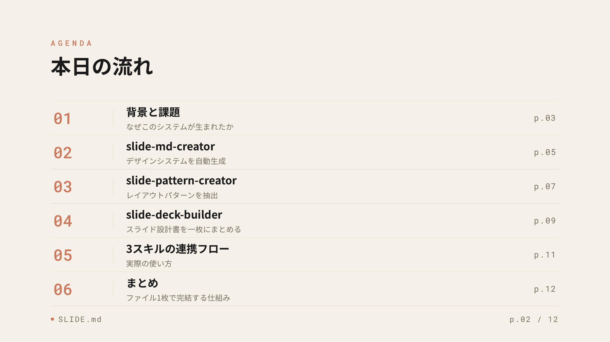
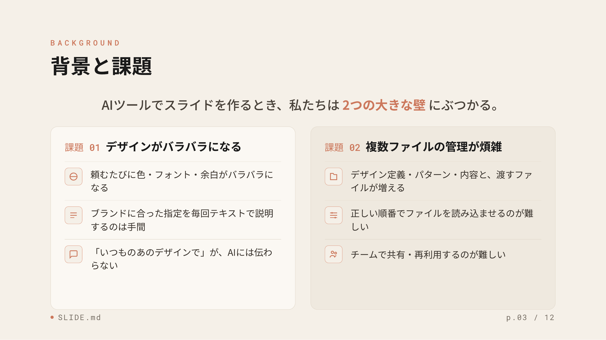

# SLIDE.md

**AIとスライドを作るための設計書フォーマットと、それを生成するClaude Codeスキルパッケージ。**


[Google DESIGN.md](https://stitch.withgoogle.com/docs/design-md/overview) のコンセプトに着想を得た、スライドに特化した設計書フォーマット「SLIDE.md」の仕様と、それを自動生成するClaude Codeスキルを公開しています。

---

## SLIDE.md とは

AIツール（Claude Design、NotebookLM、Google Slides等）にスライドを生成させるとき、毎回「色はこれ、フォントはこれ、レイアウトはこう」と説明するのは手間がかかります。また、同じAIに何度頼んでもデザインがバラバラになりがちです。

**SLIDE.mdは、そのデザイン指示を「設計書ファイル」として一度定義し、使い回すためのフォーマットです。**

### 3種類のファイルで構成される

| ファイル | 役割 |
|---------|------|
| `SLIDE.md` | デザインシステム定義。色・フォント・余白・タイトルエリア・ページ番号などを定義する。 |
| `SLIDE-PATTERN-{name}.md` | レイアウトパターン定義。コンテンツエリアの構造（カラム数・要素の配置）を定義する。 |
| `SLIDE-DECK.md` | スライド設計書。上記2ファイルの内容をすべて埋め込み、スライド構成とコンテンツひな型をまとめた1枚のブリーフ。AIツールにこのファイルだけ渡せばスライドが生成できる。 |

### 設計のポイント

**デザインと構造を分離する**：`SLIDE.md` がブランドの見た目（色・フォント）とフレーム（タイトルエリア・ページ番号）を一括管理し、`SLIDE-PATTERN-*.md` はコンテンツエリアのレイアウト構造だけを定義します。これにより、同じパターンを異なるデザインシステムに使い回せます。

**1ファイルで完結する**：`SLIDE-DECK.md` にはデザインとパターンの定義がすべて埋め込まれます。AIツールに渡すファイルは1枚だけで済みます。

---

## このリポジトリのスキルについて

SLIDE.mdフォーマットを手作業で書くのは難しいため、**Claude Code上で動作する3つのスキルを開発しました。** スライドの画像やプレゼン内容を渡すだけで、AIが自動でSLIDE.mdファイル群を生成します。

### スキルでできること

1. **既存のスライド・Webサイトのデザインを解析**して、AIが読めるデザイン定義ファイル（SLIDE.md）を自動生成
2. **スライドのレイアウト構造を抽出**して、再利用可能なパターン定義ファイル（SLIDE-PATTERN-\*.md）を生成
3. **プレゼン内容を入力**すると、デザイン＋パターン＋スライド構成をまとめた設計書（SLIDE-DECK.md）を自動生成

SLIDE-DECK.mdをClaude DesignなどのAIツールに渡すだけで、デザインの一貫したスライドが生成できます。

### スキル一覧

| スキル | できること | 出力ファイル |
|--------|-----------|------------|
| `slide-md-creator` | スライド・画像・Webサイトからデザインシステムを生成 | `SLIDE-md-{name}/SLIDE.md` + `sample.html` |
| `slide-pattern-creator` | スライドのレイアウト構造を解析してパターンを定義 | `SLIDE-PATTERN-{name}/SLIDE-PATTERN-{name}.md` + `.html` |
| `slide-deck-builder` | プレゼン内容をもとにスライド設計書を生成 | `SLIDE-DECK-{name}/SLIDE-DECK-{name}.md` |

---

## 使い方

### 1. スキルをインストールする

`skills/` フォルダ内の各スキルフォルダを、Claude Codeのスキルディレクトリ（`~/.claude/skills/`）にコピーします。

```bash
cp -r skills/slide-md-creator ~/.claude/skills/
cp -r skills/slide-pattern-creator ~/.claude/skills/
cp -r skills/slide-deck-builder ~/.claude/skills/
```

### 2. デザインシステムを作る（初回のみ）

Claude Codeで作業したいプロジェクトフォルダを開き、以下のように話しかけます。

> 「このスライドのデザインシステムを作って」（画像・Webサイト・PowerPointを添付）

`SLIDE-md-{name}/SLIDE.md` と確認用の `sample.html` が生成されます。

**sample.html について：** 生成したデザインシステムが実際にどう見えるかを確認するための5ページのHTMLスライドです。表紙・セクションタイトル・箇条書き・データ・まとめの5パターンが、SLIDE.mdで定義した色・フォント・余白を使って描画されます。ブラウザで開くだけで確認できます。

### 3. スライドパターンを追加する（任意）

このリポジトリには99種類のスライドパターンが同梱されています（`docs/patterns/`）。**これらをそのまま使う場合、この工程は不要です。** Step 4に進んでください。

自分のスライドのレイアウトや好みのパターンを新たに追加したい場合に、このスキルを使います。

> 「スライドパターンを抽出して」（スライドの画像を添付）

`SLIDE-PATTERN-{name}/SLIDE-PATTERN-{name}.md` とスケルトンHTML（グレースケール）が生成されます。

**スケルトンHTMLについて：** パターンのレイアウト構造（エリアの分割・要素の配置）を確認するためのHTMLファイルです。色・フォント・装飾をあえて取り除いたグレースケールで描画されています。これは、パターンがどのデザインシステムとも組み合わせて使えるよう、構造だけを示すことを意図した設計です。実際のスライドに色やフォントを適用するのはSLIDE.mdの役割です。

### 4. プレゼンの設計書を作る

> 「プレゼンの設計書を作って」

ブリーフ（タイトル・対象者・目的・枚数）をヒアリングした後、プレゼン内容を受け取り、SLIDE-DECK.md を生成します。このファイル1枚をAIツールに渡すだけでスライドが生成できます。

## ワークフロー

```
Step 1: slide-md-creator  → SLIDE.md（ブランドのデザインを一度定義）
Step 2: slide-pattern-creator → SLIDE-PATTERN-*.md（使いたいレイアウトを随時追加）
Step 3: slide-deck-builder → SLIDE-DECK.md（プレゼンごとに設計書を生成）
Step 4: SLIDE-DECK.md をAIツールへ → スライド完成
```

---

## パターンギャラリー

99種類のレイアウトパターンをブラウザで一覧確認できます。

**→ <a href="https://sho-ai-magic.github.io/slide.md/" target="_blank">https://sho-ai-magic.github.io/slide.md/</a>**


## 生成サンプル

このスキルパッケージを使って生成したスライドの例です（[PDF全文はこちら](examples/output/SLIDE.md%20スキル紹介.pdf)）。





## サンプルファイル

- `examples/design-systems/SLIDE-md-anthropic/` — Anthropicのブランドカラーを参考に生成したデザインシステムの例
- `examples/output/SLIDE.md スキル紹介.pdf` — このスキルパッケージを紹介するスライドの生成例（全文）
- `docs/patterns/` — 99種類のレイアウトパターンのHTMLファイル（ギャラリーから参照）

## ライセンス

MIT
